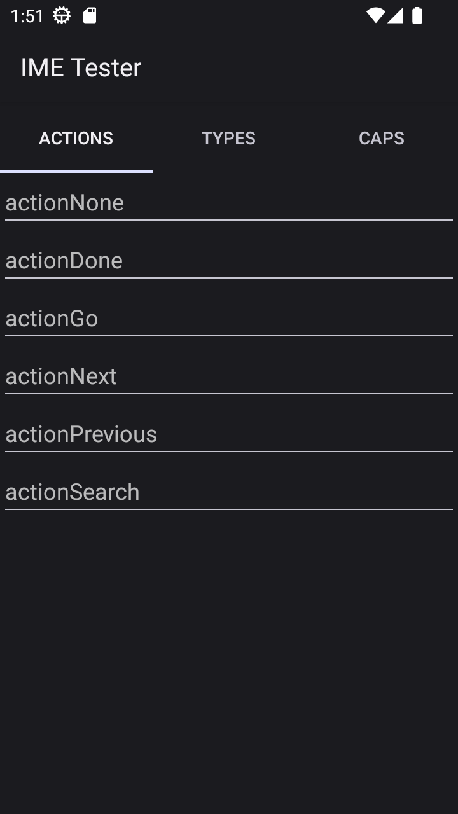
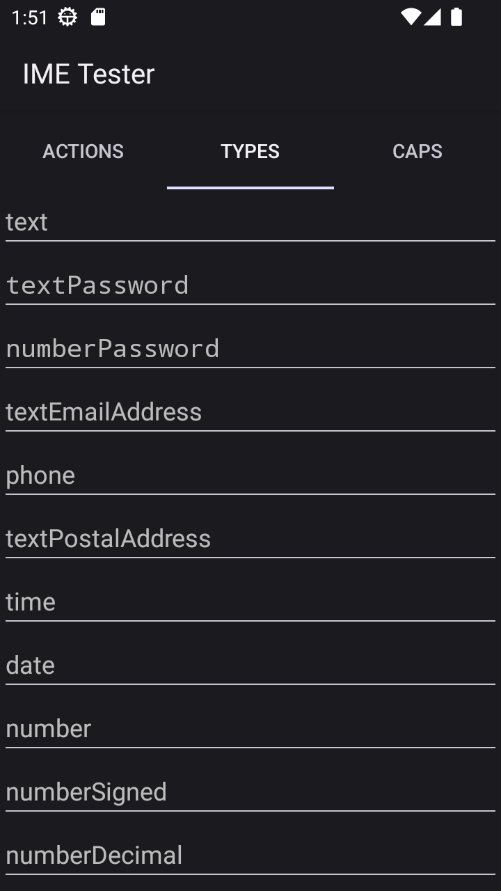
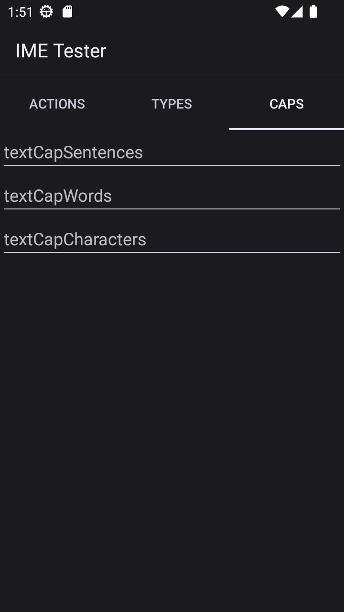

# Input Method Tester

  
  
  

## About

Test actions and layout of your virtual keyboard. This application contains a collection various input fields:
- Actions
  - Enter key behaviour
  - https://developer.android.com/reference/android/view/inputmethod/EditorInfo
- Types
  - Layout behaviour
  - https://developer.android.com/reference/android/text/InputType
- Caps
  - Capitalization behaviour
  - https://developer.android.com/reference/android/text/InputType

More types of inputs can be added as requested.

## License

License type: MIT
