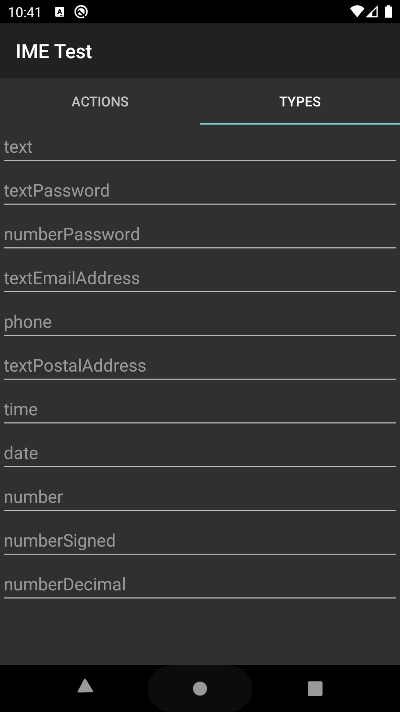

# Input Method Tester

  
  

## About

Test actions and layout of your virtual keyboard. This application contains a collection various input fields:
- Actions
  - Enter key behaviour
  - https://developer.android.com/reference/android/view/inputmethod/EditorInfo
- Types
  - Layout behaviour
  - https://developer.android.com/reference/android/text/InputType
  
 More types of inputs can be added as requested.
  
## Downloads

  
## License

License type: MIT
